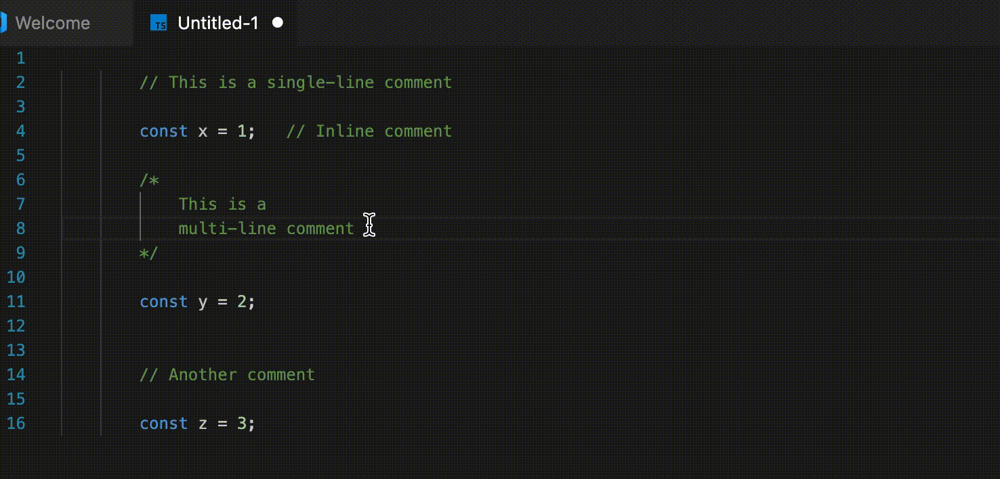

# NoComment: Instant Comment Removal for Cleaner Code

Tired of clutter in your code, especially from AI-generated comments? **NoComment** is a powerful VS Code extension designed to effortlessly **remove all comments from your files in an instant**. Achieve a cleaner, more readable codebase with a single click.

## Key Features

### Blazingly Fast Performance
Experience lightning-fast comment removal, optimizing your workflow without delay.

### Intelligent Comment Recognition
NoComment is smart enough to differentiate between actual comments and similar text found within regex patterns or URLs, ensuring accurate and safe code cleaning.

### Broad Language Support
NoComment supports a wide range of programming languages, making it a versatile tool for any developer.

---

### Stay Updated!
This extension is under active development. Enable auto-updates in VS Code to ensure you always have the latest features and improvements.

---

## Version 1.0.0

* Initial public release.

---

## Get in Touch

* [Contact Me](http://code.visualstudio.com/docs/languages/markdown)
* [My GitHub](https://github.com/galih9)

---

**Enjoy a cleaner coding experience with NoComment!**